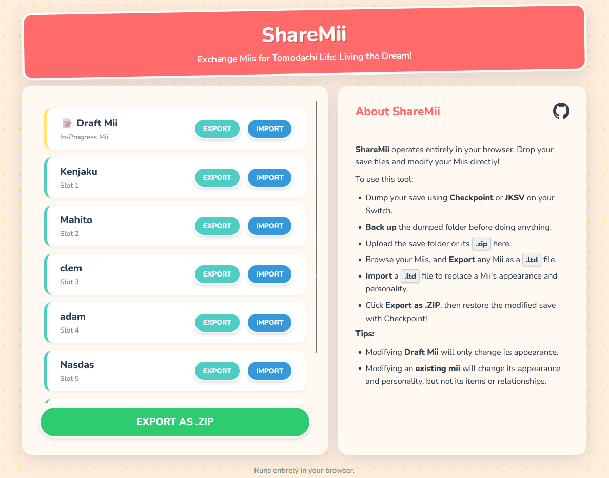

# ShareMii

  

> A web-based tool for editing Mii data for **Tomodachi Life: Living the Dream!**. It allows users to edit the Miis of their save files, and export single Miis to be used in other save files.

 ***ShareMii** doesn't save any data, it all runs inside your browser.*

## Usage

Dump your save data using **Checkpoint** or **JKSV** on your Switch, (or your game folders if you use an emulator), backup them first. Then, you can export any Mii as a `.ltd` file, or import a `.ltd` file to replace a Mii. Finally, click **Export as .ZIP** to save your modified save data. Current link :

https://sharemii.qwkuns.me/

## Known issues

- When you edit the **Draft Mii**, the only retained information will be its appearance.
- When you edit an **already existing Mii**, it will edit its name, properties, appearance, without editing its relationship, clothes or items.

## Contributing

Contributions are welcome. I'd love a proper video preview but I don't have time to do it cleanly, so if anyone wants to add that (or ugc support, or anything else), go for it. Just please follow [conventional commits](https://www.conventionalcommits.org/) when you push.

## Credits

- [JSZip](https://github.com/Stuk/jszip) for handling .zip files, by [@Stuk](https://github.com/Stuk).
- [ShareMii](https://github.com/Star-F0rce/ShareMii) for the original idea and python code, by [@Star-F0rce](https://github.com/Star-F0rce).